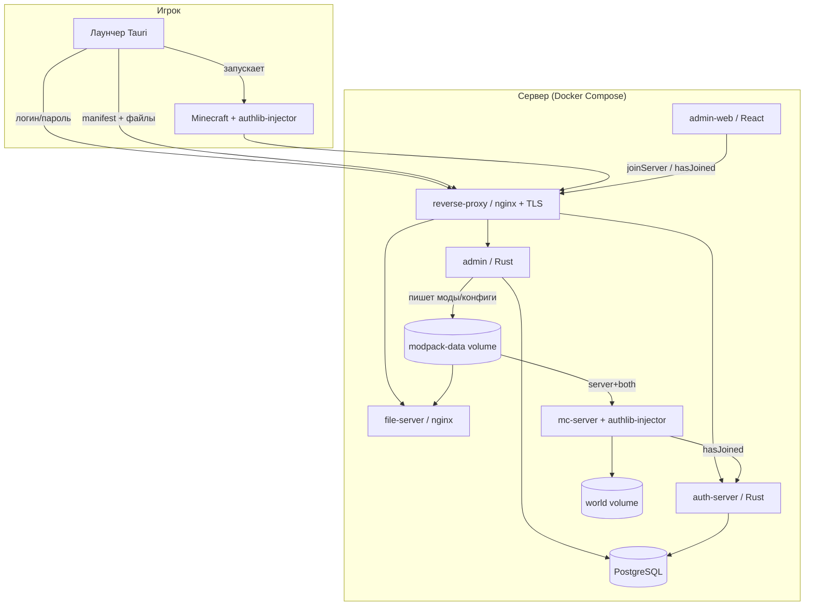
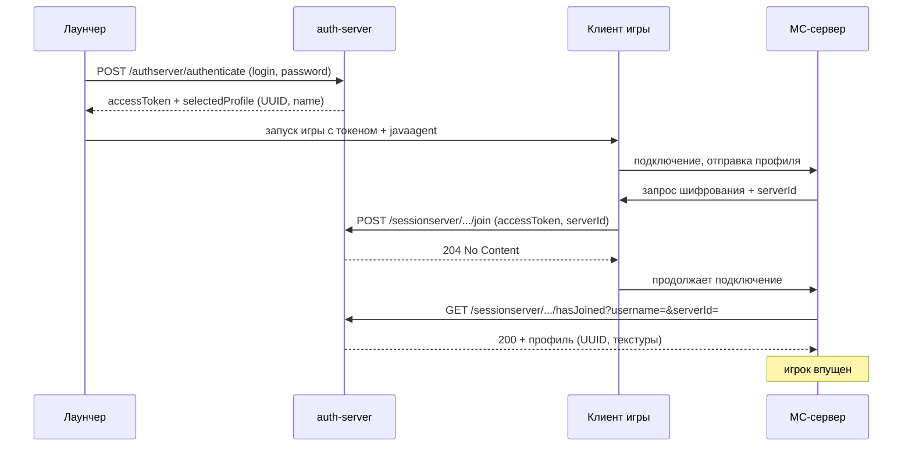
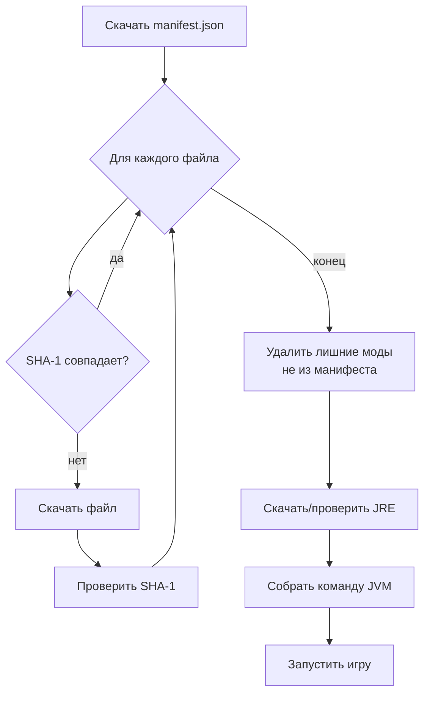

# Архитектура

## Обзор

## Поток авторизации (Yggdrasil + authlib-injector)

Сервер остаётся в `online-mode=true`. authlib-injector подменяет зашитые
URL Mojang на наш `auth-server` — и на клиенте (через лаунчер), и на сервере
(через `-javaagent`).

## Модель сборки (modpack)

Каждый файл сборки имеет:

- `path` — путь относительно `.minecraft` (напр. `mods/sodium.jar`)
- `side` — `client` | `server` | `both`
- `kind` — `mod` | `config` | `resource` | `other`
- `sha1`, `size`
- `overwrite` — затирать ли локальную версию (для конфигов часто `false`)

**Клиентский манифест** содержит файлы со `side ∈ {client, both}`.
**Серверная папка** — файлы со `side ∈ {server, both}`.

Формат манифеста определён в общем crate `crates/protocol`.

## Процесс обновления (лаунчер)

## Statefulness (Docker volumes)

| Volume          | Содержимое                       | Кто пишет | Кто читает         |
| --------------- | -------------------------------- | --------- | ------------------ |
| `pgdata`        | БД PostgreSQL                    | postgres  | postgres           |
| `modpack-data`  | моды, конфиги, манифест          | admin     | file-server, mc    |
| `world`         | мир Minecraft                    | mc        | mc                 |

Контейнеры эфемерны; всё состояние — в volumes.
